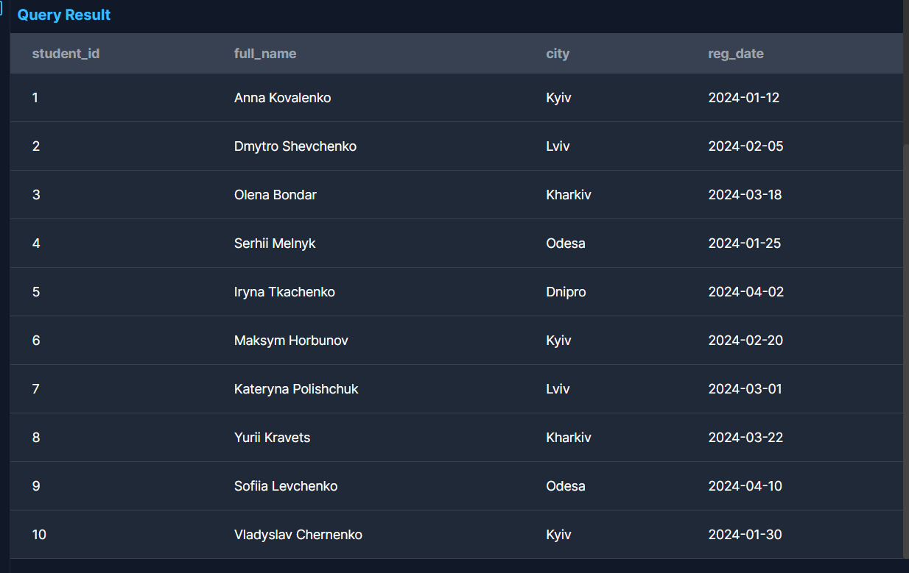
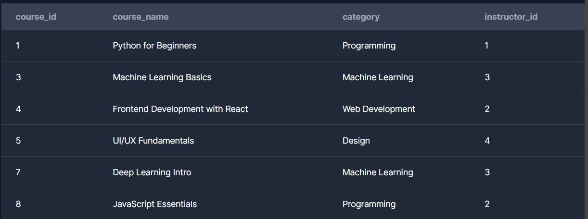

Задача 1. Базові SELECT
Вивести всіх студентів, які зареєструвалися після 2024‑01‑01.# online_study_platform
learning project

Вивести всі курси категорії "Data Science".

Задача 2. Групування та агрегація
Порахувати кількість студентів у кожному місті.

Порахувати кількість курсів у кожній категорії.

Порахувати середню оцінку по кожному курсу.
