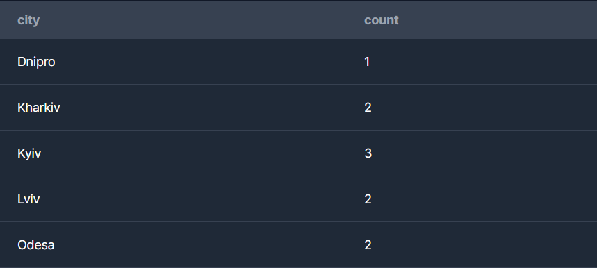
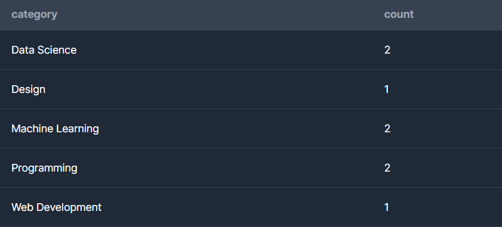
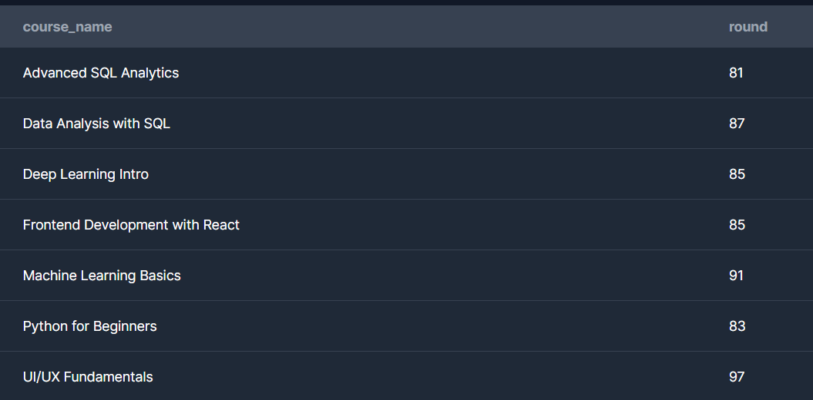
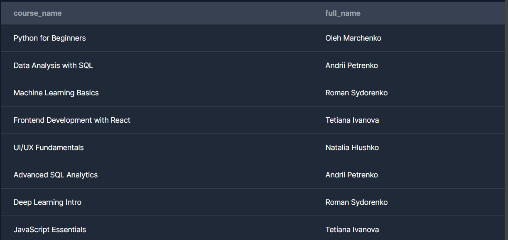
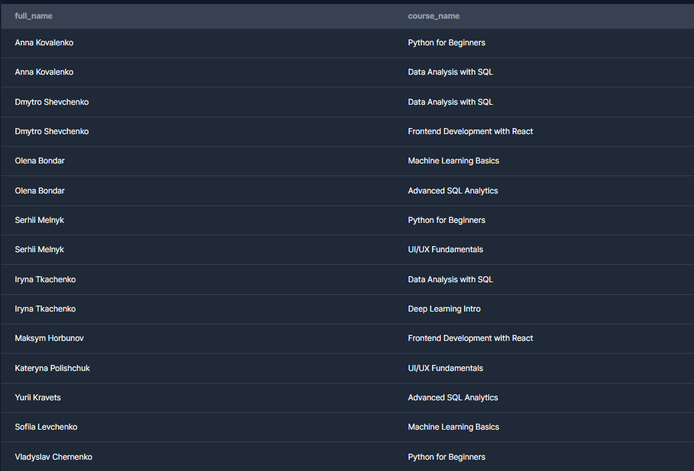
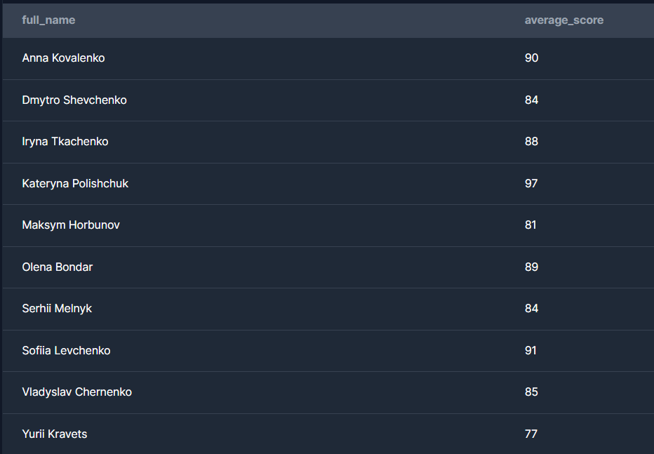
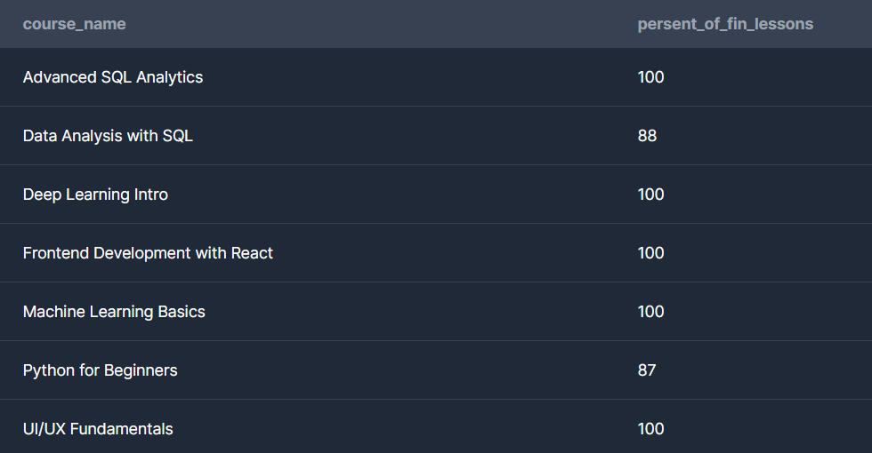
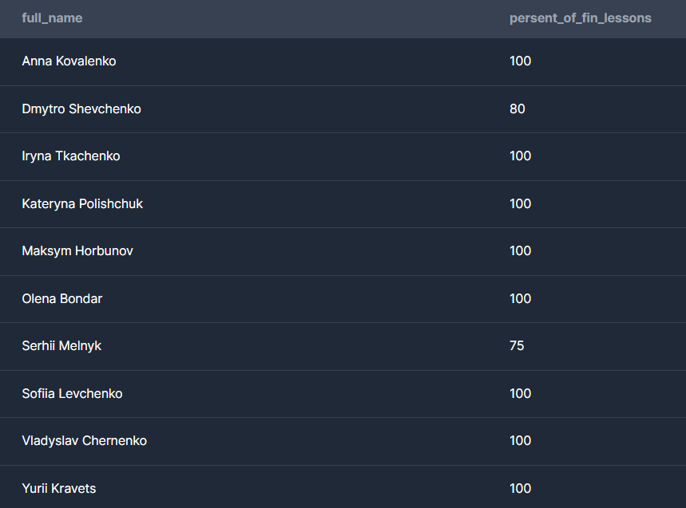
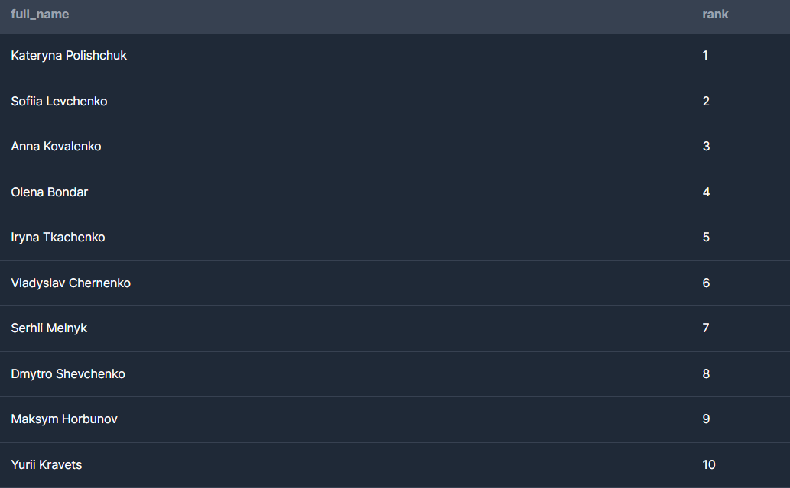
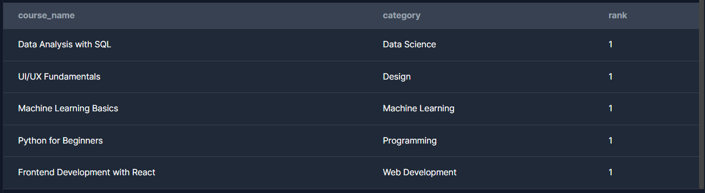

Задача 1. Базові SELECT
Вивести всіх студентів, які зареєструвалися після 2024‑01‑01.# online_study_platform
learning project

Вивести всі курси категорії "Data Science".

Задача 2. Групування та агрегація
Порахувати кількість студентів у кожному місті.

Порахувати кількість курсів у кожній категорії.

Порахувати середню оцінку по кожному курсу.

Задача 3. JOIN‑аналіз Вивести список курсів разом з іменами викладачів. 

Вивести студентів та назви курсів, на які вони записані. 

Порахувати, скільки студентів у кожного викладача.

Задача 4. Аналітика прогресу
Порахувати середню оцінку кожного студента.

Порахувати відсоток завершених уроків для кожного курсу.

Знайти студентів, які завершили всі уроки у своїх курсах.

Задача 5. Віконні функції Для кожного курсу визначити рейтинг студентів за середнім балом. 

Порахувати кумулятивну кількість уроків, завершених студентом у хронологічному порядку.

Для кожної категорії курсів знайти топ‑1 курс за кількістю студентів.
